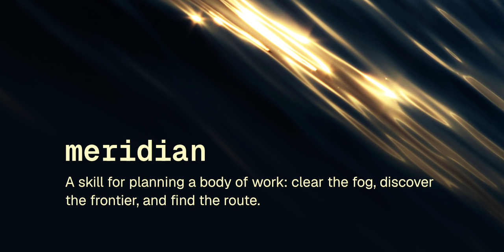

# meridian

Planning skill charts your work. Diagnose the fog, diverge honestly, decide one question at a time. Dead ends stay on the chart.

 

A skill that turns an idea, feature, bug, or open-ended brainstorm into a planned body of work — a durable map of decisions, kept on the issue tracker your team already uses, that a whole effort can steer by.

This skill follows the [Agent Skills specification](https://agentskills.io/specification) so it can be used by any skills-compatible agent.

## Installation

### npx skills
    npx skills add robcsaszar/meridian

### Marketplace
    /plugin marketplace add robcsaszar/meridian
    /plugin install robcsaszar-meridian@meridian

### Manually
Copy the `skills/meridian/` directory into your project's `.claude/skills/`.

## What it does

Bring it anything from a half-formed hunch to a well-understood feature. The skill first settles where the map will live: it reads a persisted choice from `CONTEXT.md` or `AGENTS.md`, or infers one from the repo — GitHub Issues, Jira, or a `plans/` file when there is no tracker — and confirms with you before writing anything into a shared system, offering to record the choice so later sessions skip the question.

Then it takes bearings: how clear is the destination? When the way is fogbound — no ideas, samey ideas, a constraint that feels unbreakable, a nagging sense you're solving the wrong problem — it runs a structured divergence pass where techniques are allowed to fail visibly and weak ideas die in the open. Once a direction survives, it charts the frontier breadth-first: every open decision becomes its own ticket, typed by what unblocks it — your judgment, research, an experiment, or a task that has to happen first — and wired with the tracker's native blocking so the frontier is visible in the tracker's own UI.

Charting is one session. Each session after that claims one ticket and resolves it: judgment by interview, one question at a time with a recommended answer and its weakness; research by a scout subagent whose findings you sign off; experiments deferred to a spike; tasks done or handed to you as a checklist. Resolved decisions accrete on the map, ruled-out paths stay on the chart with their kill reasons, and fog graduates into fresh tickets as answers sharpen it.

The map is done when no open decisions remain. A final session distills the decision log into a route: ordered work items with acceptance criteria, each traceable to the decision that shaped it. It never implements; it ends by naming the first move.

## License
[MIT](LICENSE) © Rob Csaszar
